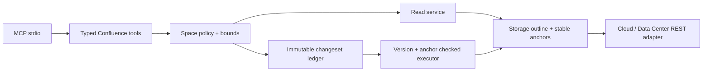

# Architecture

The MVP uses the same ports-and-adapters shape as `jira-mcp-safe` while retaining a Confluence-specific content pipeline:

The architecture is shared with the Jira project as a set of enforced invariants, not a cross-repository library: strict origin binding, credential redaction, bounded reads, explicit policy, immutable digest-bound previews, optimistic concurrency, one-time apply, and post-write verification. Keeping the code independent avoids coupling Jira field/workflow semantics to Confluence's lossless storage and section-anchor model.

Section updates are byte-preserving splices. The server locates the exact heading occurrence by recorded offsets, retains the original heading, hashes the unchanged prefix and suffix, validates only the replacement body as storage XHTML, and reconstructs the result from a fresh page read at apply time. Post-write verification requires both the next version and the exact proposed storage hash.

Page creation is a separate additive changeset. It binds both space ID and key, an optional exact parent content ID, title, complete storage-XHTML body hash, idempotency key, and source provenance. Sources are direct storage, an exact page ID/version, or a native content-template ID plus declared plain-text variables. Apply re-fetches page/template sources and rejects drift before using the platform-native create payload. Blueprint templates are excluded because generic rendering cannot supply app-specific runtime context.

Cross-product sources stay at the agent orchestration layer: selected Jira fields may inform explicit Confluence storage, and a Confluence page or content template may inform explicit Jira fields. The destination server still receives and validates its native complete create proposal. This avoids a privileged server-to-server auto-converter and keeps the reviewed payload frozen even if the external source later changes.

Current changeset storage is process-local for the local stdio profile. Remote or horizontally scaled deployments must supply durable actor- and tenant-bound storage plus an immutable audit sink.
